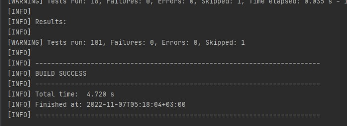

TESH-TASK
==============
A simple Java application that uses JDBC to work with PostgreSQL. The MVC pattern is used, application 
can be extended to servlet layer. (Java, PostgreSQL, JDBC, H2, JUnit 5, Mockito, Lombok)

Разработка изначально велась с использованием базы postgres. Далее в зависимостях была подключена база H2 и все тесты выполнялись на ней при условии, что она пуста.</br>
В application.properties можно указать как H2 (jdbc:h2:~/test), так и postgres БД.</br>
Таким образом, была предпринята попытка эмуляции работы с реальным приложением, когда тесты со слоем DAO могут быть чреваты последствиями.</br>
Все тесты выполняются, скриншот приложен на гитхабе.

## TASK 3

**ЗАГРУЗКА SQL СКРИПТА С ТЕСТОВЫМ НАБОРОМ ДАННЫХ**

На уровне сервисов есть 3 метода для инициализации данных:

1. init() - создает тестовые таблицы с добавлением данных для существующей базы данных;
2. initTables() - создает тестовые таблицы без добавления данных;
3. initData() - добавляет данные, если таблицы были созданы методом initTables().

Чтение скриптов происходит из src/main/resources, путь можно поменять в application.properties.

```
UserService userService = UserService.buildUserService();
userService.init();
```

## TASK 1

**ПОИСК В РЕПОЗИТОРИИ АККАУНТА ПОЛЬЗОВАТЕЛЯ ПО ИМЕНИ**

На уровне сервисов реализован метод: get(String username).

```
Optional<User> user1 = userService.get("username1");
Optional<User> user2 = userService.get("username2");
Optional<User> user3 = userService.get("username3");
```

## TASK 2

**ИЗМЕНЕНИЕ У УЧЕТНОЙ ЗАПИСИ ЛЮБОГО АТРИБУТА**

На уровне сервисов реализован метод: update(UpdateUserDto userDto)</br>

Объект проходит:

1. Валидацию: 
    * проверки username на null и пробелы/табуляции; на существование пользователя в БД;
    * на отсутствие остальных полей при введенем пользователе;
    * на существование пользователя, на чье имя хотим изменить текущее;
    * на правильный формат (dd-MM-yyyy) даты; на соответсвия коду гендера (1 - MALE, 2 - FEMALE);
    * (если валидация не проходит, то выбрасывается соответсвующей исключение ValidationException).
2. Маппинг: так как данные могут приходить с прикладного уровня, то, скорее всего, это будут строки. Для этого осуществляется маппинг на entity, с которой работает слой DAO;
3. Вызов соответсвующего метода из слоя DAO.

```
userService.update(UpdateUserDto.builder()
    .username("username1")
    .firstName("someRandomName1")
    .birthday("24-11-1998")
    .gender("2")
    .build());
userService.update(UpdateUserDto.builder()
    .username("username2")
    .newUsername("newNameForUsername2")
    .build());
Optional<User> updatedUser1 = userService.get("username1");
Optional<User> updatedUser2 = userService.get("username2");
```

## TASK 4

**ПОЛУЧИТЬ СПИСОК ВСЕХ ПОЛЬЗОВАТЕЛЕЙ, А ЗАТЕМ С ПОМОЩЬЮ Stream API НАЙТИ:**
    * имена всех пользователей, которые младше 20 лет;
    * посчитать количество пользователей, у которых фамилия оканчивается на "ов".
    
На уровне сервисов реализованы методы:

1. getAll() - получение всех пользователей;
2. filterByAge() - получение пользоваталей моложе 20 лет;
3. filterByLastNamePostfix() - получение пользователей, чьи фамилии заканчиваются на "ов".

```
List<User> users = userService.getAll();
List<User> usersFilteredByAge = userService.filterByAge();
List<User> usersFilteredByLastNamePostfix = userService.filterByLastNamePostfix();
```

## ТЕСТЫ

Тестирование проходило как на postgres (как реальная БД), так и на H2 (как тестовая БД).</br>
Перед тестированием используются DDL для создания и очистки БД после тестов.</br>
Поэтому рекомендуется убедиться, что БД существует и пуста.

Для тестирования были реализованы:
1. UserDaoTest - by-default помечен как @Disabled, чтобы тестирование случайно не провелось на реальной БД. В application.properties надо переопределить подключение на H2 (embedded).
2. UpdateUserMapperTest - тестирования маппинга UpdateUserDto в User entity, с которым работает UserDao.
3. UserServiceTest - тестирование UserService, при обращении к DAO использует моки.
4. ConnectionManagerTest - тестирует подключение к БД. Помечен как @Disabled на случай, если подключение не указано в application.properties.
5. LocalDateFormatterTest - тестирует парсинг из текстового формата даты в LocalDate.
6. ScriptsReaderTest - by-default помечен как @Disabled, потому что основной функционал использует ресурсы папки main. Тестировал изолировано от других тестов с переопределением пути к ресурсам на src/test/resources (поэтому Skipped).
7. UpdateUserValidator - тестирование валидации приходящих извне данных, использует моки для UserService при необходимости поиска существующего пользователя в БД.


